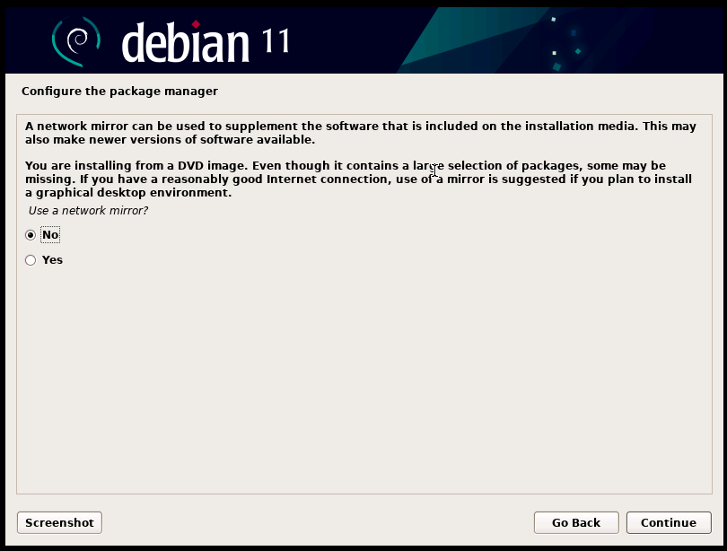

# How to setup offline sim camp (on Debian 11)?
First of all, you will need internet at some point. The goal is to prepare everything when you are online, so that you can install Debian 11 offline and fully setup sim also offline.

`run.sh` is based on [setup-sim-for-camp-on-debian11.sh](https://github.com/varqox/sim/blob/master/scripts/setup-sim-for-camp-on-debian11.sh) script, if you have internet on the machine you want to run sim on, just use that script.

## Online steps

### Getting Debian 11 iso
First of all you need to download a Debian 11 iso file. You can get it from here: [https://www.debian.org/distrib/](https://www.debian.org/distrib/). Which to choose? You can go with netinst -- contrary to what name says, it can be used offline as well. But preferred option is a complete installation image (DVD) because it is easier to install SSH with it.

Let's refer to this image as `debian.iso` from now on.

### Creating online and offline VMs
Second thing to do will be making two virtual machines and installing `debian.iso` on them. It is easiest to do using QEMU. Install qemu and proceed with the following steps. For your convenience you can first do all steps for `online`, and then all steps for `offline` if you wish.

1. Create two directories `online` and `offline`.
2. In both of them create file called `run-img` with contents:
- for `online`:
```
qemu-system-x86_64 -device virtio-scsi-pci,id=scsi0 -drive file=vm.img,format=raw,if=none,id=drive0 -device scsi-hd,bus=scsi0.0,drive=drive0 \
    -net user,hostfwd=tcp::11103-:22 -net nic,model=virtio \
    -enable-kvm \
    -m 4G \
    -display none \
    -smp cores=$(nproc) \
    -chardev stdio,id=cons -device virtio-serial-pci -device virtconsole,chardev=cons \
    $@
```
- for `offline`:
```
qemu-system-x86_64 -device virtio-scsi-pci,id=scsi0 -drive file=vm.img,format=raw,if=none,id=drive0 -device scsi-hd,bus=scsi0.0,drive=drive0 \
    -net user,hostfwd=tcp::11104-:22 -net nic,model=virtio \
    -enable-kvm \
    -m 4G \
    -display none \
    -smp cores=$(nproc) \
    -chardev stdio,id=cons -device virtio-serial-pci -device virtconsole,chardev=cons \
    $@
```

You can tweak these scripts to your needs e.g. changing amount of memory from `4G` to something else. What is important is the fact that `online` machine will have ssh server listening on `localhost:11103` and `offline` on `localhost:11104`.

3. Make `run-img` executable with `chmod +x run-img` in both `online` and `offline`.
4. Create disk images in both `online` and `offline` with command: `qemu-img create -f raw vm.img 8G`
5. Run both VMs with `./run-img -display gtk -cdrom path/to/debian.iso`.
6. Install Debian (without swap) on both VMs, with one little difference between them. The difference comes at this stage of installation:



Choose "Yes" for `online` VM, and "No" for `offline` VM.

7. Another important step is:


Make your selection as shown in the screenshot (on both VMs).

8. Finish installation and reboot into the fresh Debian on both `online` and `offline` VM.

9. Create ssh aliases for both `online` and `offline` VM. You can for example edit your `~/.ssh/config` file and append these lines:
```
Host vm-online
	Hostname localhost
	Port 11103
	User username_of_user_you_have_setup_on_debian_install

Host vm-offline
	Hostname localhost
	Port 11104
	User username_of_user_you_have_setup_on_debian_install
```
Remember to change `username_of_user_you_have_setup_on_debian_install` appropriately.

From now on, we will use `vm-online` and `vm-offline` as ssh aliases for `online` and `offline` vms respectively.

10. Preferably copy ssh key to `vm-online` and `vm-offline` so that you won't have to type your password quite a few times: `ssh-copy-id vm-online` and `ssh-copy-id vm-offline`

### Preparing packages for offline setup

1. Copy package preparation scripts:
    - Run `scp packages/prepare_packages_run_on_online_vm.sh vm-online:/tmp/`
    - Run `scp packages/prepare_packages_run_on_offline_vm.sh vm-offline:/tmp/`
2. Run simultaneously:
    - `packages/prepare_packages.sh vm-online vm-offline` on your local (host) machine
    - `/tmp/prepare_packages_run_on_online_vm.sh` as root on `online` VM.
    - `/tmp/prepare_packages_run_on_offline_vm.sh` as root on `offline` VM.

3. Note that `packages/` directory was filled with new files -- these files are what is needed to setup sim offline.

## Offline steps
1. Install `debian.iso` on the machine you want sim to run on.
2. Copy `run.sh` and `packages` (including files that filled it in the "Preparing packages for offline setup" step) onto that machine. E.g. `scp -r run.sh packages/ sim-camp-machine:/tmp/`
3. Run `run.sh username_of_user_you_have_setup_on_debian_install` as root.
4. Change default password for user `sim`.
5. Finish camp network setup so that participants will have access to sim. (It is beyond the scope of this manual.)
